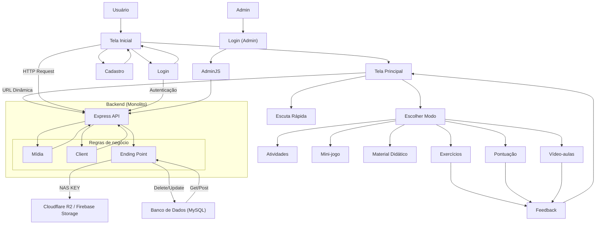

> Projeto acadêmico desenvolvido para o **Orgulho De Ser SESI**, com foco em **gestão, integração e acessibilidade**.  
> O sistema é **real e funcional**, construído em arquitetura monolítica modular.


---

## 📑 Sumário
- [Sobre o Projeto](#-sobre-o-projeto)
- [Arquitetura](#-arquitetura)
- [Protótipo](#-protótipo)
- [Fluxograma](#-fluxograma)
- [Requisitos de Sistema](#-requisitos-de-sistema)
- [Como Executar](#-como-executar)
- [Equipe](#-equipe)
- [Licença](#-licença)

## 📖 Sobre o Projeto
O **Nuvia** é um **sistema integrado** que permite **cadastro, gerenciamento e consulta de informações** de forma simples e intuitiva.  
Ele foi desenvolvido em formato **monolito modular**, visando clareza, organização e escalabilidade.  

Este projeto é parte do **Orgulho de ser SESI** e foi totalmente implementado e demonstrado em ambiente real.

---

## 🏗 Arquitetura

### Backend
- **Node.js** com **Express**  
- Banco de dados **MySQL**  
- Estrutura monolítica organizada em camadas:  
  - `config/` → conexão com banco  
  - `controllers/` → lógica de entrada/saída  
  - `modules/` → camada de negócio (services, models)  
  - `middleware/` → validações e autenticação  
  - `utils/` → funções auxiliares  
  - `server.ts` → ponto de entrada  

### Frontend
- **Angular 20** + **Bootstrap 5** + **Tailwind 4**
- Requisitos Funcionais:  
  - [ ] Login  
  - [ ] Cadastro de usuários  
  - [ ] Autenticação com tratamento de erros  
  - [ ] Tela principal  
  - [ ] Atividades  
  - [ ] Jogos  
  - [ ] Material didático  
  - [ ] Feedback  

---

## 🎨 Protótipo

Protótipo inicial criado no **Figma**, representando o fluxo e design da interface:  

[](https://www.figma.com/design/gdpUL4jo7zat9q4YVNgPJm/Nuvia?m=auto&t=GPzbP8Z7V2SMTxTA-6)

## 🔀 Fluxograma

Fluxograma do sistema, detalhando o fluxo de usuários e dados:  

Visualização mais limpa no: 

[](https://www.figma.com/board/K6uekkQey6R03ballExgLq/Fluxograma-Nuvia?t=GPzbP8Z7V2SMTxTA-6)

---

## 💻 Requisitos de Sistema

Antes de rodar o projeto, garanta que sua máquina atende aos requisitos:

- **Sistema Operacional**: Linux, macOS ou Windows  
- **Docker**: >= 20.10  
- **Docker Compose**: >= 2.0  
- **Node.js**: >= 20.x (para desenvolvimento local sem container)  
- **Angular CLI**: >= 20.x (para desenvolvimento local sem container)  
- **RAM mínima**: 4 GB
- **Banco de dados**: MySQL (já incluso no container)  

## 🚀 Como Executar

### Usando Docker Compose (recomendado)
```bash
# Clone o repositório
git clone https://github.com/seu-repo/nuvia.git
cd nuvia

# Suba os containers
docker compose up --build

#A aplicação estará disponível em:
- Frontend → http://localhost:4200
- Backend → http://localhost:3000
- MySQL → localhost:3306
```
### Desenvolvimento Local (sem Docker)
```bash
# Backend
cd backend
npm install
npm run dev

# Frontend
cd frontend
npm install
ng serve
```
## 👥 Equipe

| Avatar | Nome | GitHub |
|--------|------|--------|
|  | **Diego Gabriel** | [@diego10gabriel](https://github.com/diego10gabriel) |
|  | **Douglas Rafael** | [@douglasrfsantos](https://github.com/douglasrfsantos) |
|  | **Jotapeqzz** | [@Jotapeqzz](https://github.com/Jotapeqzz) |
|  | **Vinícius Rodrigues** | [@ViniciusRodrigues0079](https://github.com/ViniciusRodrigues0079) |
|  | **Marcondes_Paixão** | [@Junior010101](https://github.com/Junior010101) |
|  | **Enzo Andrade** | [@treasurestar](https://github.com/treasurestar) |

## 📜 Licença

Este projeto foi desenvolvido **exclusivamente para fins acadêmicos e empresariais (SESI)**. Não é permitida a distribuição, cópia ou uso fora deste contexto.


